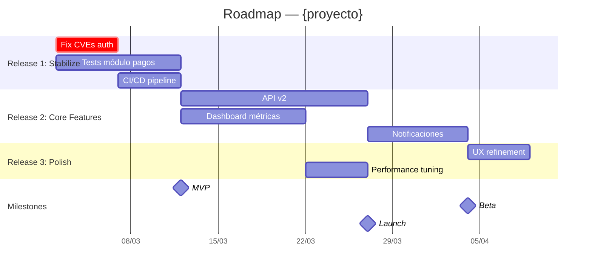

# Project Roadmap

**Argumentos:** $ARGUMENTS

> Uso: `/project-roadmap --project {p}` o con `--release-plan {file}`

## Parámetros

- `--project {nombre}` — Proyecto de PM-Workspace (obligatorio)
- `--release-plan {file}` — Fichero de release plan (defecto: último)
- `--format {mermaid|drawio|miro}` — Formato de diagrama (defecto: mermaid)
- `--audience {tech|executive}` — Nivel de detalle
- `--include-assignments` — Incluir asignaciones por persona
- `--output {format}` — Texto: `md` (defecto), `pptx`

## Contexto requerido

1. `projects/{proyecto}/CLAUDE.md` — Config del proyecto
2. `output/plans/` — Último release plan
3. `.claude/skills/diagram-generation/SKILL.md` — Generación de diagramas
4. `.claude/rules/diagram-config.md` — Config Draw.io/Miro

## Pasos de ejecución

### 1. Cargar datos
- Release plan → releases, sprints, PBIs, dependencias
- Asignaciones → si `/project-assign` ya ejecutado
- Calendario → fechas de sprints, festivos

### 2. Generar diagrama Gantt (Mermaid)



### 3. Adaptar por audiencia

**tech**: incluye PBIs, tasks, dependencias, asignaciones por persona
**executive**: solo releases, milestones, fechas clave, riesgos top

### 4. Publicar diagrama

- Si `--format mermaid` → incluir en markdown del roadmap
- Si `--format drawio` → usar `/diagram-generate` → exportar XML
- Si `--format miro` → usar `/diagram-generate` → publicar board

### 5. Generar resumen ejecutivo

```
## Roadmap — {proyecto}
Fecha: YYYY-MM-DD | Horizonte: {n} sprints ({m} semanas)

### Timeline visual
[Gantt diagram above]

### Milestones
| Milestone | Fecha | Releases | Estado |
|---|---|---|---|
| MVP | 2026-03-14 | R1 | 🔴 Pendiente |
| Beta | 2026-04-11 | R1+R2 | — |
| Launch | 2026-04-25 | R1+R2+R3 | — |

### Riesgos para el timeline
1. Dependencia de API Gateway (equipo Platform) → retraso +1 sprint
2. Capacity reducida en Sprint 4 (vacaciones Ana)

### Próximos pasos
1. Aprobar release plan
2. Iniciar Sprint 1 con scope de Release 1
3. Review de progreso en Sprint Review
```

### 6. Guardar
- Diagrama: `output/roadmaps/YYYYMMDD-roadmap-{proyecto}.mermaid`
- Resumen: `output/roadmaps/YYYYMMDD-roadmap-{proyecto}.md`
- Si `--output pptx` → usar `/report-executive` para presentación

## Integración

- `/project-release-plan` → (Phase 2) fuente de datos principal
- `/project-assign` → (Phase 3) asignaciones para vista tech
- `/project-kickoff` → (Phase 5) incluye roadmap en el kickoff
- `/diagram-generate` → publicar en Draw.io o Miro
- `/report-executive` → versión presentación del roadmap

## Restricciones

- Solo lectura — no crea work items ni modifica Azure DevOps
- Diagrama Mermaid es local; Draw.io/Miro requieren config previa
- Fechas son estimadas, basadas en velocity y capacity
