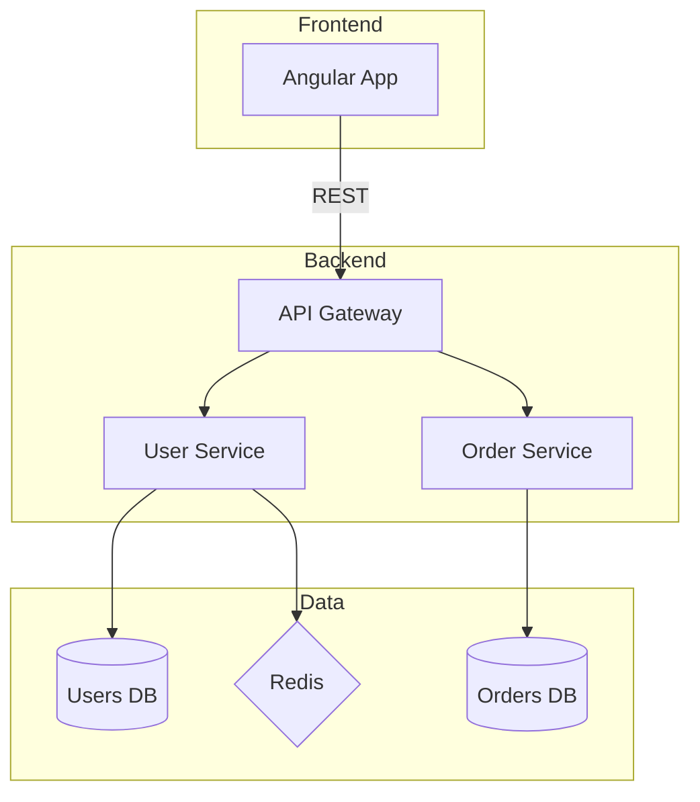
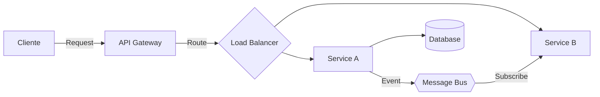
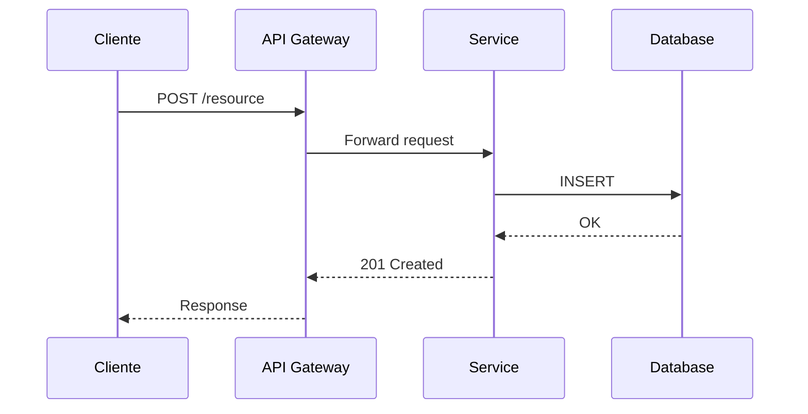

# Skill: Diagram Generation — Arquitectura y Flujo

## Propósito

Generar diagramas de arquitectura, flujo de datos y secuencia a partir de la infraestructura y código fuente de un proyecto. Exportar a Draw.io, Miro o formato local (Mermaid).

---

## Triggers

- Comando `/diagram-generate` — Genera diagrama completo
- Petición directa: "genera el diagrama de arquitectura del proyecto X"

---

## Contexto Requerido (Progressive Disclosure)

1. `CLAUDE.md` (raíz) — Contexto global
2. `projects/{proyecto}/CLAUDE.md` — Stack, arquitectura, repos
3. `projects/{proyecto}/infrastructure/` — Terraform, Docker, K8s si existen
4. `.claude/rules/diagram-config.md` — Constantes y configuración
5. `.claude/rules/pm-config.md` — Credenciales MCP

---

## Fase 1: Detección de Componentes

Analizar el proyecto para identificar componentes arquitectónicos:

### 1.1 Fuentes de detección (en orden de prioridad)

1. **Infraestructura como código** — `*.tf`, `docker-compose.yml`, `k8s/`, `helm/`
2. **Código fuente** — `*.csproj`, `package.json`, `pom.xml`, `go.mod`, etc.
3. **Documentación existente** — `CLAUDE.md` del proyecto, `architecture.md`
4. **Azure DevOps** — Repos, pipelines, service connections (via MCP)

### 1.2 Entidades a detectar

| Entidad | Detección | Icono Mermaid |
|---|---|---|
| Microservicio / API | `*.csproj` con `Sdk="Microsoft.NET.Sdk.Web"`, `Dockerfile` | `[Nombre]` box |
| Base de datos | `ConnectionString`, `DbContext`, recursos `azurerm_sql_*` en TF | `[(DB)]` cylinder |
| Cola / Bus | `ServiceBus`, `RabbitMQ`, `AzureServiceBus` en config | `{{Cola}}` hexagon |
| Almacenamiento | `BlobStorage`, `S3`, `azurerm_storage_*` | `[/Storage/]` parallelogram |
| API Gateway | `Ocelot`, `YARP`, `Kong`, `azurerm_api_management` | `[[Gateway]]` subroutine |
| Frontend / SPA | `angular.json`, `next.config.*`, `vite.config.*` | `(Frontend)` rounded |
| Servicio externo | Referencias a APIs externas, SDKs de terceros | `>Externo]` asymmetric |
| CDN / Cache | `Redis`, `azurerm_cdn_*`, `CloudFront` | `{Cache}` rhombus |

### 1.3 Relaciones a detectar

- **HTTP/REST** — Referencias entre proyectos, `HttpClient`, Swagger refs
- **Mensajería** — Productores/consumidores de colas/topics
- **Base de datos** — Qué servicios acceden a qué DBs
- **Dependencia directa** — Project references, imports, packages compartidos

---

## Fase 2: Generación de Modelo Mermaid

Construir la representación en Mermaid según el tipo de diagrama:

### Architecture (C4-style)



### Flow (Data Flow)



### Sequence



---

## Fase 3: Exportar a Herramienta MCP

### 3.1 Draw.io (MCP `draw-io`)

1. Convertir Mermaid → XML Draw.io (usar las tools del MCP)
2. Crear o actualizar diagrama en Draw.io
3. Obtener URL compartible
4. Si el proyecto tiene `DRAWIO_FOLDER` configurado → usar esa carpeta

### 3.2 Miro (MCP `miro`)

1. Verificar token OAuth válido
2. Crear frame en board del proyecto (o crear board nuevo)
3. Convertir entidades a shapes de Miro + conectores
4. Obtener URL del board
5. Si el proyecto tiene `MIRO_BOARD_ID` configurado → añadir al board existente

### 3.3 Local (sin MCP)

1. Guardar fichero `.mermaid` en `projects/{p}/diagrams/local/`
2. Mostrar el Mermaid en la respuesta para preview

---

## Fase 4: Guardar Metadata

Crear/actualizar `projects/{p}/diagrams/{tool}/{tipo}.meta.json`:

```json
{
  "tool": "draw-io",
  "type": "architecture",
  "name": "System Architecture — {proyecto}",
  "url": "https://...",
  "remote_id": "...",
  "local_mermaid": "diagrams/local/architecture.mermaid",
  "created": "2026-02-26T...",
  "last_sync": "2026-02-26T...",
  "elements": {
    "services": 4,
    "databases": 2,
    "queues": 1,
    "external": 2,
    "connections": 12
  }
}
```

---

## Fase 5: Presentar Resultado

```
✅ Diagrama generado: {tipo} — {proyecto}

🔗 URL: {link}
📊 Elementos: {N} servicios, {N} DBs, {N} colas, {N} conexiones
📁 Metadata: projects/{p}/diagrams/{tool}/{tipo}.meta.json
📝 Mermaid local: projects/{p}/diagrams/local/{tipo}.mermaid

¿Quieres importar este diagrama para generar Features/PBIs? → /diagram-import
```

---

## Referencias

- `references/mermaid-templates.md` — Plantillas base por tipo de diagrama
- `references/draw-io-shapes.md` — Mapeo entidades → shapes Draw.io
- `references/miro-board-structure.md` — Estructura de boards Miro
