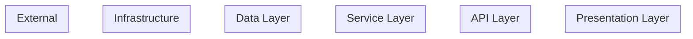
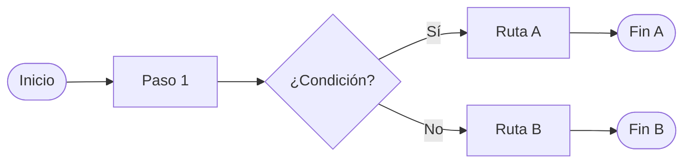
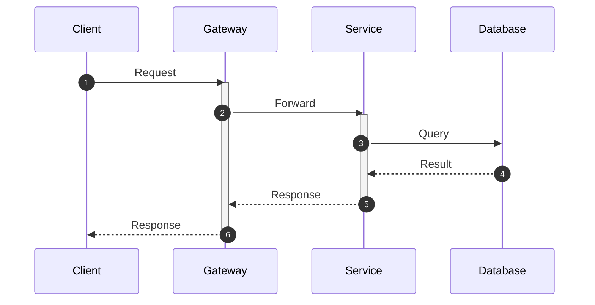

# Plantillas Mermaid para Diagramas de Arquitectura

> Referencia para la skill `diagram-generation`. Plantillas base que se adaptan según los componentes detectados.

## Architecture (C4-style simplificado)



### Convenciones de forma

| Entidad | Sintaxis Mermaid | Ejemplo |
|---|---|---|
| Servicio/API | `[Nombre]` | `SVC1[User Service]` |
| Base de datos | `[(Nombre)]` | `DB1[(Users DB)]` |
| Cola/Bus | `{{Nombre}}` | `BUS{{Service Bus}}` |
| Cache | `{Nombre}` | `CACHE{Redis}` |
| Almacenamiento | `[/Nombre/]` | `BLOB[/Blob Storage/]` |
| Gateway | `[[Nombre]]` | `GW[[API Gateway]]` |
| Frontend/SPA | `(Nombre)` | `WEB(Angular App)` |
| Externo | `>Nombre]` | `EXT>Stripe API]` |

### Convenciones de flecha

| Relación | Sintaxis | Significado |
|---|---|---|
| HTTP/REST sync | `-->` | Llamada síncrona |
| HTTP con label | `-->|verb /path|` | Endpoint específico |
| Mensajería async | `-.->` | Evento/mensaje asíncrono |
| Lectura DB | `-->` | Query/Read |
| Escritura DB | `==>` | Write/Command |
| Dependencia | `..>` | Dependencia indirecta |

## Flow (Flujo de datos)



## Sequence (Diagrama de secuencia)



## Colores recomendados (classDef)

```mermaid
classDef frontend fill:#4FC3F7,stroke:#0288D1,color:#fff
classDef backend fill:#81C784,stroke:#388E3C,color:#fff
classDef database fill:#FFB74D,stroke:#F57C00,color:#fff
classDef queue fill:#BA68C8,stroke:#7B1FA2,color:#fff
classDef external fill:#E0E0E0,stroke:#616161,color:#333
classDef cache fill:#FFD54F,stroke:#FFA000,color:#333
```
