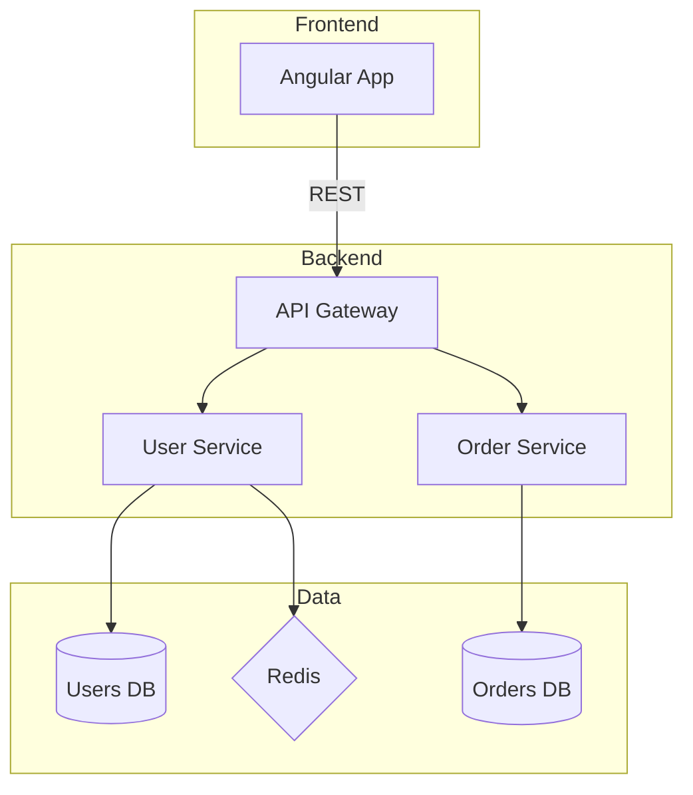
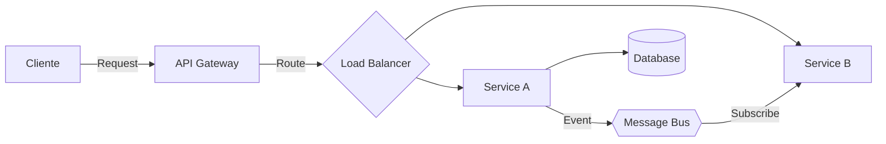
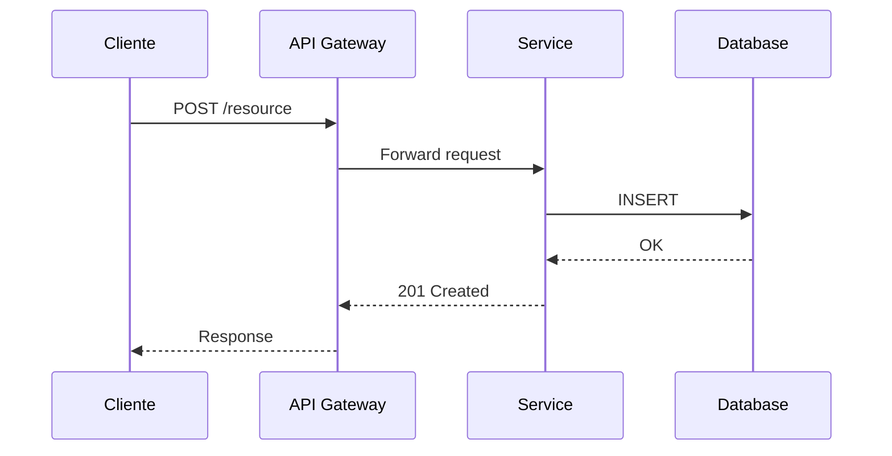
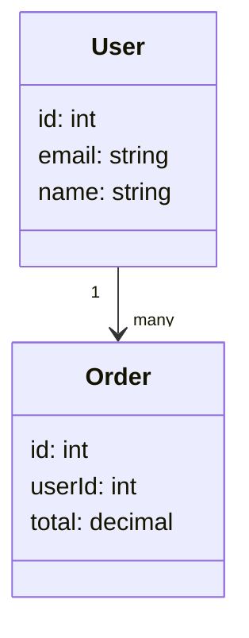

# Mermaid Templates — Por Tipo de Diagrama

## Architecture (C4-style)

## Flow (Data Flow)

## Sequence (Temporal)

## Class (Domain Model)

## Shapes de Mermaid

- `[Box]` — Proceso/entidad simple
- `[(DB)]` — Base de datos
- `{{Hexagon}}` — Cola/Bus
- `{Diamond}` — Decisión/Cache
- `(Rounded)` — Componente amigable (UI, Frontend)
- `[[Subroutine]]` — Función/API
- `>Asymmetric]` — Servicio externo
- `[/Parallelogram/]` — Almacenamiento
