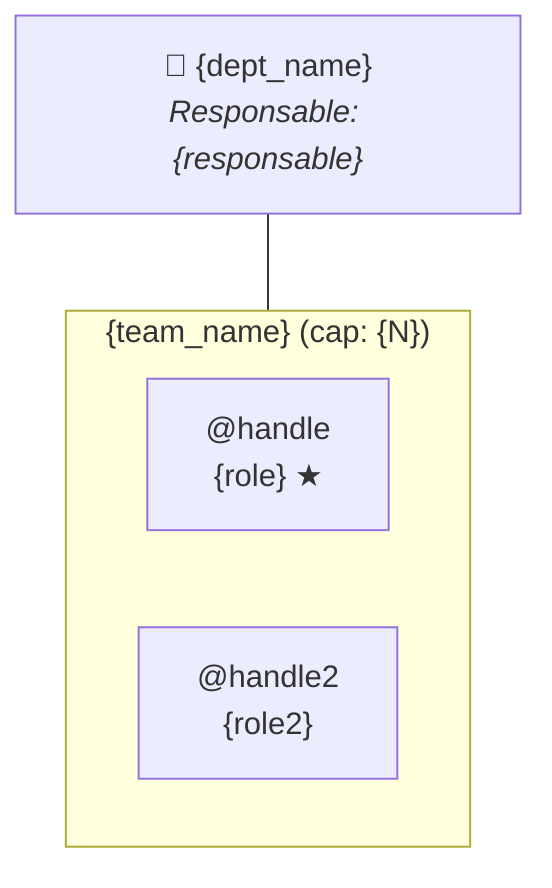

# Mermaid Parser — Orgchart Import

> Parsea ficheros `.mermaid` generados por `/diagram-generate --type orgchart`.

## Formato esperado



## Reglas de parseo

### Departamento

- Patron: `DEPT["🏢 {name}<br/><i>Responsable: {resp}</i>"]`
- O simplificado: `DEPT["{name}"]`
- Extraer `name` del texto entre 🏢 y `<br/>`
- Extraer `responsable` del texto entre `Responsable: ` y `</i>`
- Si responsable es `—` o vacio → `null`

### Equipos

- Patron: `subgraph {id}["{name} (cap: {N})"]` ... `end`
- `id` = identificador del subgraph (sin comillas)
- `name` = texto entre comillas, antes de ` (cap:`
- `capacity_total` = numero tras `cap: `, antes de `)`
- Si no hay `(cap: N)` → calcular sumando capacidades de miembros

### Miembros

- Patron: `SQ_{team}_{handle}["@{handle}<br/>{role} ★"]`
- O sin lead: `SQ_{team}_{handle}["@{handle}<br/>{role}"]`
- `handle` = texto tras `@`, antes de `<br/>`
- `role` = texto tras `<br/>`, antes de ` ★` o cierre `"`
- `is_lead` = presencia de ` ★` en el texto del nodo
- `capacity` = `capacity_total / num_miembros` (distribucion uniforme)

### Supervisor links

- Patron: edge punteado `A -.-> B` o `A -.- B`
- `from` = nodo origen (handle del supervisor)
- `to` = nodo destino (handle del supervisado)
- Extraer handles de los IDs de nodo (`SQ_team_handle` → `@handle`)

### Jerarquia dept-team

- Patron: `DEPT --- {team_id}` (linea solida)
- Confirma que el equipo pertenece al departamento
- No genera datos adicionales (ya implicito en la estructura)

## Ejemplo de parseo

Input:
```
subgraph squad1["Squad1 (cap: 2.0)"]
    SQ_squad1_eduardo["@eduardo<br/>tech-lead ★"]
    SQ_squad1_daniel["@daniel<br/>tech-lead"]
end
```

Output (fragmento del modelo):
```json
{
  "name": "Squad1",
  "capacity_total": 2.0,
  "members": [
    { "handle": "@eduardo", "role": "tech-lead", "is_lead": true, "capacity": 1.0 },
    { "handle": "@daniel", "role": "tech-lead", "is_lead": false, "capacity": 1.0 }
  ]
}
```

## Edge cases

- Nodos sin `@` prefijo: warn, proponer como handle
- Nodos sin `<br/>` (solo nombre): usar nombre como handle, role = "member"
- Subgraph sin capacity: calcular desde miembros (default 1.0 cada uno)
- Multiples `DEPT` nodos: error, solo 1 departamento por diagrama
