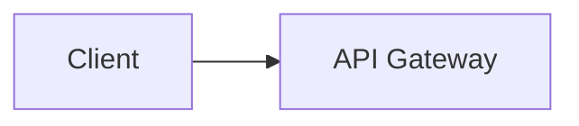

<!-- docs-lint: skip R7 R5 -->

# Guia de estilo documental — Savia Workspace

Norma unica de estilo para toda la documentacion del workspace.
Aplica a: `docs/`, raiz, `projects/*/docs/`. No aplica a: prompts
operativos (commands/, agents/), specs archivados, CHANGELOG.d,
CONSTITUCION.md, CRITERIO.md, fixtures de tests.

## 1. Registro y tono

- **Registro formal corporativo.** Tercera persona o impersonal. Voz activa.
- **Sin exclamaciones.** Cero signos de admiracion fuera de codigo o output literal.
- **Sin lexico coloquial.** Evitar: "destaca", "sorprende", "util", "recomendable", "extenso",
  "trabajar", "implicarse", y equivalentes en otros idiomas.
- **Sin emojis en documentacion.** Los simbolos de estado en tablas usan
  `OK`/`FAIL` o caracteres ASCII. Excepcion: output literal de herramientas
  en bloques de codigo (```).

**Correcto:**
```
El workspace utiliza 120 skills registradas y 99 hooks activos.
```

**Incorrecto:**
```
El workspace destaca un monton!! Tiene 120 skills y 99 hooks 
```

## 2. Un idioma por documento

- Idioma declarado en frontmatter: `lang: es|en|ca|gl|eu|it`.
- **Un solo idioma por documento.** No mezclar español e ingles en el mismo
  parrafo. Terminos tecnicos consolidados en ingles permitidos dentro de
  texto en español (`pipeline`, `hook`, `commit`, `merge`).
- Documentos multilingues: version separada por idioma con sufijo de lengua
  (`README.ca.md`, `README.gl.md`). Ver seccion 6.

## 3. Sin imagenes embebidas

- **Prohibidas imagenes locales.** Sin `` ni `` a rutas
  del repo. Los diagramas se representan en mermaid o ASCII.
- **Badges funcionales permitidos.** Shields.io y similares en README,
  exclusivamente por su funcion de CI/metadatos. Imagen decorativa: NO.

**Correcto:**


<!-- Image removed per SE-259 S2: example of local architecture image reference -->

## 4. Cifras del sistema: sin hardcodear

- **Prohibido hardcodear conteos de entidades del workspace** (hooks, skills,
  agentes, comandos, scripts, tests). Tres alternativas:
  - a) Prosa sin cifra: "los hooks del workspace"
  - b) Include generado: marcador `<!-- counts:hooks -->` que un build step
    materializa
  - c) Documento historico con marca temporal: "99 hooks (a fecha 2026-07)"
- Excepcion: cifras de dominio de negocio, configuraciones tecnicas concretas
  (timeouts, thresholds), referencias a specs/programas (SE-XXX).

**Correcto:**
```
Los hooks del workspace gestionan eventos de ciclo de vida.
```

**Incorrecto:**
```
El workspace tiene 99 hooks.
```

## 5. Enlaces

- **Enlaces internos relativos** (`[texto](../ruta)`) verificables. Sin enlaces
  absolutos al mismo repo.
- **Prohibido enlazar a ramas** (`/blob/main/` → `/blob/{rama}/`). Usar `main`
  o commit hash.
- **Verificar enlaces** antes de merge: `docs-lint --check-links`.

## 6. Estrategia multilingue

- Documentos traducidos mantienen sufijo ISO 639-1: `README.ca.md`,
  `CONTRIBUTING.gl.md`.
- **README.md (español) es la fuente de verdad.**
- Traducciones llevan banner cuando divergen de la fuente:
  ```
  > Traduccion de cortesia. Version de referencia: [español](README.md).
  > Ultima sincronizacion: YYYY-MM-DD.
  ```
- PR que modifica la fuente sin actualizar traducciones: CI avisa con lista
  de idiomas afectados.

## 7. Encabezados y estructura

- Un solo H1 (`#`) por documento, coincidente con el titulo.
- H2 (`##`) para secciones principales. Sin saltar niveles.
- Sin H1 vacio ni repetido.

## 8. Aplicacion

- `scripts/docs-lint.sh` aplica estas reglas en CI y local.
- Modo warning en CI durante adopcion; modo block tras completar migracion.
- Exencion temporal via `<!-- docs-lint: skip R1,R4 -->` por documento.
