# Agent Invocation Graph

> Generated: 2026-07-25T17:03:24Z | SE-270 Slice 4
> Max detected depth: **2** (limit: 2) — **PASS**
> Deepest path: `feasibility-probe → dotnet-developer → test-architect`

## Graph

```mermaid
graph TD
    python-developer["python-developer"] --> test-architect["test-architect"]
    python-developer["python-developer"] --> test-engineer["test-engineer"]
    feasibility-probe["feasibility-probe"] --> dotnet-developer["dotnet-developer"]
    feasibility-probe["feasibility-probe"] --> python-developer["python-developer"]
    feasibility-probe["feasibility-probe"] --> typescript-developer["typescript-developer"]
    cobol-developer["cobol-developer"] --> test-architect["test-architect"]
    cobol-developer["cobol-developer"] --> test-engineer["test-engineer"]
    commit-guardian["commit-guardian"] --> security-auditor["security-auditor"]
    pptx-digest["pptx-digest"] --> archive-digest["archive-digest"]
    meeting-digest["meeting-digest"] --> archive-digest["archive-digest"]
    go-developer["go-developer"] --> test-architect["test-architect"]
    go-developer["go-developer"] --> test-engineer["test-engineer"]
    php-developer["php-developer"] --> test-architect["test-architect"]
    php-developer["php-developer"] --> test-engineer["test-engineer"]
    ruby-developer["ruby-developer"] --> test-architect["test-architect"]
    ruby-developer["ruby-developer"] --> test-engineer["test-engineer"]
    frontend-developer["frontend-developer"] --> test-architect["test-architect"]
    frontend-developer["frontend-developer"] --> test-engineer["test-engineer"]
    security-guardian["security-guardian"] --> security-auditor["security-auditor"]
    dotnet-developer["dotnet-developer"] --> test-architect["test-architect"]
    dotnet-developer["dotnet-developer"] --> test-engineer["test-engineer"]
    pdf-digest["pdf-digest"] --> archive-digest["archive-digest"]
    java-developer["java-developer"] --> test-architect["test-architect"]
    java-developer["java-developer"] --> test-engineer["test-engineer"]
    rust-developer["rust-developer"] --> test-architect["test-architect"]
    rust-developer["rust-developer"] --> test-engineer["test-engineer"]
    mobile-developer["mobile-developer"] --> test-architect["test-architect"]
    mobile-developer["mobile-developer"] --> test-engineer["test-engineer"]
    typescript-developer["typescript-developer"] --> test-architect["test-architect"]
    typescript-developer["typescript-developer"] --> test-engineer["test-engineer"]
    excel-digest["excel-digest"] --> archive-digest["archive-digest"]
    recommendation-tribunal-orchestrator["recommendation-tribunal-orchestrator"] --> sycophancy-judge["sycophancy-judge"]
    recommendation-tribunal-orchestrator["recommendation-tribunal-orchestrator"] --> concession-judge["concession-judge"]
    recommendation-tribunal-orchestrator["recommendation-tribunal-orchestrator"] --> repetition-truth-judge["repetition-truth-judge"]
    recommendation-tribunal-orchestrator["recommendation-tribunal-orchestrator"] --> authority-claim-judge["authority-claim-judge"]
    recommendation-tribunal-orchestrator["recommendation-tribunal-orchestrator"] --> hallucination-fast-judge["hallucination-fast-judge"]
    recommendation-tribunal-orchestrator["recommendation-tribunal-orchestrator"] --> memory-conflict-judge["memory-conflict-judge"]
    recommendation-tribunal-orchestrator["recommendation-tribunal-orchestrator"] --> rule-violation-judge["rule-violation-judge"]
    recommendation-tribunal-orchestrator["recommendation-tribunal-orchestrator"] --> expertise-asymmetry-judge["expertise-asymmetry-judge"]
    recommendation-tribunal-orchestrator["recommendation-tribunal-orchestrator"] --> fiction-framing-judge["fiction-framing-judge"]
    recommendation-tribunal-orchestrator["recommendation-tribunal-orchestrator"] --> structural-framing-judge["structural-framing-judge"]
    confidentiality-auditor["confidentiality-auditor"] --> security-guardian["security-guardian"]
    court-orchestrator["court-orchestrator"] --> architecture-judge["architecture-judge"]
    court-orchestrator["court-orchestrator"] --> cognitive-judge["cognitive-judge"]
    court-orchestrator["court-orchestrator"] --> correctness-judge["correctness-judge"]
    court-orchestrator["court-orchestrator"] --> security-judge["security-judge"]
    court-orchestrator["court-orchestrator"] --> spec-judge["spec-judge"]
    court-orchestrator["court-orchestrator"] --> fix-assigner["fix-assigner"]
    court-orchestrator["court-orchestrator"] --> pr-agent-judge["pr-agent-judge"]
    security-attacker["security-attacker"] --> security-auditor["security-auditor"]
    truth-tribunal-orchestrator["truth-tribunal-orchestrator"] --> factuality-judge["factuality-judge"]
    truth-tribunal-orchestrator["truth-tribunal-orchestrator"] --> coherence-judge["coherence-judge"]
    truth-tribunal-orchestrator["truth-tribunal-orchestrator"] --> completeness-judge["completeness-judge"]
    truth-tribunal-orchestrator["truth-tribunal-orchestrator"] --> compliance-judge["compliance-judge"]
    truth-tribunal-orchestrator["truth-tribunal-orchestrator"] --> calibration-judge["calibration-judge"]
    truth-tribunal-orchestrator["truth-tribunal-orchestrator"] --> hallucination-judge["hallucination-judge"]
    truth-tribunal-orchestrator["truth-tribunal-orchestrator"] --> source-traceability-judge["source-traceability-judge"]
    model-upgrade-auditor["model-upgrade-auditor"] --> dotnet-developer["dotnet-developer"]
    model-upgrade-auditor["model-upgrade-auditor"] --> java-developer["java-developer"]
    model-upgrade-auditor["model-upgrade-auditor"] --> python-developer["python-developer"]
    model-upgrade-auditor["model-upgrade-auditor"] --> typescript-developer["typescript-developer"]
    word-digest["word-digest"] --> archive-digest["archive-digest"]
    pentester["pentester"] --> security-auditor["security-auditor"]
    terraform-developer["terraform-developer"] --> test-architect["test-architect"]
    terraform-developer["terraform-developer"] --> test-engineer["test-engineer"]
    drift-auditor["drift-auditor"] --> reconciler["reconciler"]
    visual-digest["visual-digest"] --> archive-digest["archive-digest"]
    test-engineer["test-engineer"] --> test-architect["test-architect"]
    security-defender["security-defender"] --> security-auditor["security-auditor"]
```

## Delegation Table

| Caller | Allowed Targets |
|---|---|
| python-developer | test-architect,test-engineer |
| feasibility-probe | dotnet-developer,python-developer,typescript-developer |
| cobol-developer | test-architect,test-engineer |
| commit-guardian | security-auditor |
| pptx-digest | archive-digest |
| meeting-digest | archive-digest |
| go-developer | test-architect,test-engineer |
| php-developer | test-architect,test-engineer |
| ruby-developer | test-architect,test-engineer |
| frontend-developer | test-architect,test-engineer |
| security-guardian | security-auditor |
| dotnet-developer | test-architect,test-engineer |
| pdf-digest | archive-digest |
| java-developer | test-architect,test-engineer |
| rust-developer | test-architect,test-engineer |
| mobile-developer | test-architect,test-engineer |
| typescript-developer | test-architect,test-engineer |
| excel-digest | archive-digest |
| recommendation-tribunal-orchestrator | sycophancy-judge,concession-judge,repetition-truth-judge,authority-claim-judge,hallucination-fast-judge,memory-conflict-judge,rule-violation-judge,expertise-asymmetry-judge,fiction-framing-judge,structural-framing-judge |
| confidentiality-auditor | security-guardian |
| court-orchestrator | architecture-judge,cognitive-judge,correctness-judge,security-judge,spec-judge,fix-assigner,pr-agent-judge |
| security-attacker | security-auditor |
| truth-tribunal-orchestrator | factuality-judge,coherence-judge,completeness-judge,compliance-judge,calibration-judge,hallucination-judge,source-traceability-judge |
| model-upgrade-auditor | dotnet-developer,java-developer,python-developer,typescript-developer |
| word-digest | archive-digest |
| pentester | security-auditor |
| terraform-developer | test-architect,test-engineer |
| drift-auditor | reconciler |
| visual-digest | archive-digest |
| test-engineer | test-architect |
| security-defender | security-auditor |

---
Generated by scripts/agent-depth-limit.sh
