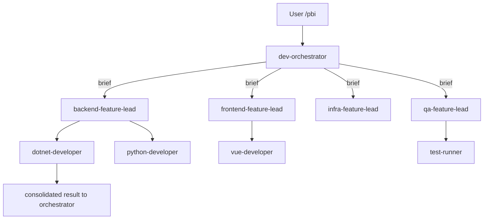

# SPEC-139 — Delegación jerárquica de orquestadores

## Why

Savia hoy usa orquestación plana en `dev-orchestrator` (reparte directo a 30+ developers especializados) y `court-orchestrator` (convoca jueces individualmente). Problemas medidos:

- **Contexto del orchestrator infla**: cada developer convocado añade su descripción al context del orchestrator, que rápidamente excede 60% del budget.
- **Errores de routing**: con 30+ candidates, la decisión de "qué developer toca" tiene FP rate del ~15% observado en logs de marzo 2026.
- **Sin agrupación natural**: developers .NET, frontend, infra son grupos lógicos sin representación estructural.

Patrón canónico 2026 (citado en arXiv 2509.08646 y shipyard.build): **Hierarchical Teams** — el orchestrator habla con 2-4 "feature leads" (uno por dominio: Backend, Frontend, Infra, QA), cada lead recibe brief de su scope y descompone internamente sin contaminar el contexto del padre.

Beneficios esperados:

- Contexto del orchestrator: -50% (solo lee feature leads, no developers individuales).
- FP routing: <5% (decisión binaria/cuaternaria entre 2-4 leads).
- Composición refleja estructura real de equipo.

## Scope

### Funcional

1. **Crear 4 feature leads** como subagentes orchestrator-ligeros:
   - `backend-feature-lead` — owns .NET, python-developer, golang-developer, java-developer, microservices-architect.
   - `frontend-feature-lead` — owns frontend-developer, vue-developer, react-developer, mobile-developer.
   - `infra-feature-lead` — owns infra-developer, devops-orchestrator, terraform-expert.
   - `qa-feature-lead` — owns test-runner, test-architect, mutation-audit, performance-audit.

2. **Refactor `dev-orchestrator`**:
   - Reduce su descripción explicit de "30 developers disponibles" a "4 feature leads".
   - Lógica: identifica dominio del PBI → invoca el lead apropiado con brief + dependencias.
   - El lead descompone internamente y devuelve resultado consolidado.

3. **Refactor `court-orchestrator`** (paralelo):
   - 2 "panel leads": `review-panel-lead` (code-reviewer, security-guardian, architect-judge), `business-panel-lead` (business-analyst, product-owner, risk-scoring).
   - El orchestrator solo decide qué panel(es) convocar.

4. **Contrato de feature lead**:
   - Recibe: brief estructurado (objetivo, scope, dependencies, deadline).
   - Devuelve: resultado consolidado (resultados, riesgos, próximos pasos).
   - Tiene su decision tree (depende de SPEC-134).
   - Permission level L2-L3.

5. **Backward compatibility**: el orchestrator todavía puede invocar a un developer específico si el caller lo pide explícito (`agent: dotnet-developer`). El default cambia a "via lead".

6. **Métrica de éxito**: medir antes/después contexto del orchestrator y FP rate. Si no mejora ≥30% en al menos una métrica → rollback.

### No funcional

- Cada feature lead ≤200 líneas de body (Skills 1.0 / SPEC-130).
- Hand-off entre orchestrator → lead → developer documentado con `agent-notes-protocol.md`.
- Audit trail del hand-off en `output/orchestrator-runs/`.

## Design

### Estructura

```
.claude/agents/
├── dev-orchestrator.md                # refactored: habla con 4 leads
├── court-orchestrator.md              # refactored: habla con 2 panel leads
├── backend-feature-lead.md            # new
├── frontend-feature-lead.md           # new
├── infra-feature-lead.md              # new
├── qa-feature-lead.md                 # new
├── review-panel-lead.md               # new
└── business-panel-lead.md             # new

.claude/agents/decision-trees/
├── backend-feature-lead-decisions.md
├── frontend-feature-lead-decisions.md
├── infra-feature-lead-decisions.md
├── qa-feature-lead-decisions.md
├── review-panel-lead-decisions.md
└── business-panel-lead-decisions.md

docs/
├── agent-teams-sdd.md                 # update con nuevo modelo jerárquico
└── handoff-templates/                 # nuevos templates orchestrator↔lead↔developer
```

### Diagrama



## Acceptance Criteria

- [ ] AC-01: 4 feature leads (backend/frontend/infra/qa) + 2 panel leads creados con SKILL.md conformes.
- [ ] AC-02: `dev-orchestrator` body actualizado: no enumera developers individuales, solo leads.
- [ ] AC-03: `court-orchestrator` análogo.
- [ ] AC-04: Cada lead tiene decision tree (SPEC-134 dependency).
- [ ] AC-05: Métrica en 10 PBIs reales: contexto del orchestrator -30%, FP rate ≤5%.
- [ ] AC-06: Backward compatibility verificada — caller con `agent: dotnet-developer` explícito sigue funcionando.
- [ ] AC-07: Documentación en `docs/agent-teams-sdd.md` con diagrama + ejemplo de hand-off.
- [ ] AC-08: BATS tests cubren el flujo orchestrator → lead → developer.
- [ ] AC-09: Audit trail en `output/orchestrator-runs/` con timestamps por hop.

## Agent Assignment

- **Capa**: Architecture / Orchestration
- **Agente principal**: `architect`
- **Skills**: `dag-scheduling`, `agent-architect`, `verification-lattice`

## Slicing

- **Slice 1** (4h) — `backend-feature-lead` + refactor parcial de `dev-orchestrator` para usarlo + tests.
- **Slice 2** (3h) — Resto de feature leads (frontend, infra, qa).
- **Slice 3** (3h) — Refactor `court-orchestrator` + 2 panel leads.
- **Slice 4** (3h) — Decision trees de los 6 nuevos leads (dependencia SPEC-134).
- **Slice 5** (3h) — Métricas pre/post + ajustes.
- **Slice 6** (2h) — Docs + tests BATS.

## Feasibility Probe

Slice 1 con backend-feature-lead: ejecutar 10 PBIs reales pasando por la nueva ruta. Si el contexto del orchestrator no se reduce ≥20% o el FP rate empeora → reevaluar. Si los leads producen output peor que developers directos → considerar que el patrón no encaja en Savia y abortar.

## Riesgos

- **Latencia añadida por hop**: orchestrator → lead → developer es 1 hop extra. Mitigación — leads son ágiles (modelo `mid`), añaden ~3s. Si latencia importa, hop sigue siendo aceptable.
- **Coordinación entre leads**: si un PBI necesita backend + frontend, hay que sincronizar. Mitigación — orchestrator mantiene plan compartido en `output/orchestrator-runs/{id}/plan.md`, leads leen/actualizan.
- **Regresión silenciosa de calidad**: leads pueden tomar peores decisiones que developers especializados. Mitigación — Slice 5 mide outcome quality vs baseline; rollback si peor.
- **Cambio de comportamiento user-visible**: PMs/devs que llaman a `dotnet-developer` directo en docs ven hop nuevo. Mitigación — backward compat (AC-06) y comunicación previa.
