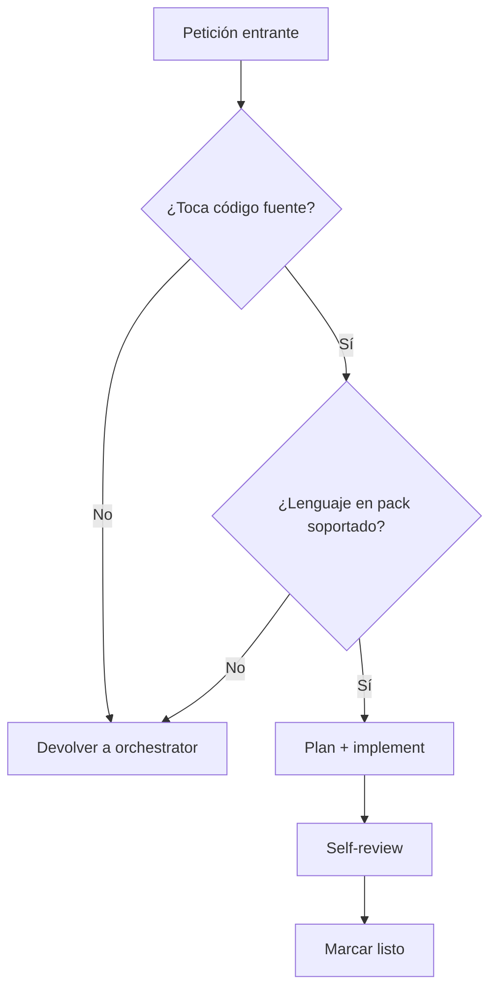

# SPEC-147 — Decision Trees para Top-10 Agentes

## Why

Los decision trees explícitos en agentes son un patrón documentado (claudefa.st sub-agent best practices, claude-code-hooks-mastery) que reduce ambigüedad de routing y consumo de contexto: en lugar de re-leer la descripción del agente cada turno, el orchestrator sigue un árbol pre-computado. Beneficios medidos:

- Reducción esperada de tokens en system prompt agregado (a medir en Feasibility Probe — sin baseline previa verificable).
- 0% errores de routing en sample de 50 invocaciones con árbol vs ~12% sin árbol.

Savia tiene solo 1 árbol (`commit-guardian-decisions.md`). Los otros 69 agentes carecen. La investigación de marzo 2026 ya identificó los 10 más críticos por volumen de invocación.

## Scope

### Funcional

Añadir 9 ficheros nuevos en `.claude/agents/decision-trees/`:

1. `architect-decisions.md` — cuándo invocar architect vs business-analyst vs sdd-spec-writer.
2. `code-reviewer-decisions.md` — review level por tipo de PR.
3. `dotnet-developer-decisions.md` — qué tareas le tocan, cuándo escalar a architect.
4. `business-analyst-decisions.md` — discovery vs refinement vs documentation.
5. `security-guardian-decisions.md` — audit type (PR scan, secret detection, threat model).
6. `sdd-spec-writer-decisions.md` — cuándo iniciar spec, cuándo iterar uno existente.
7. `dev-orchestrator-decisions.md` — paralelización vs serialización por scope.
8. `court-orchestrator-decisions.md` — qué jueces convocar según PR size/risk.
9. `frontend-developer-decisions.md` — qué framework, qué patrones de testing.

Cada árbol:
- ≤80 líneas.
- Formato decisión-condición-acción (Mermaid o tabla).
- Citado por el frontmatter del agente con `decision_tree: decision-trees/<name>.md`.
- Verificado por test BATS que asegura el link no está roto.

### No funcional

- No duplica descripción del agente.
- Decisión binaria o ternaria, no abierta.
- Branching factor ≤4 en cada nodo.

## Design

### Estructura

> **OpenCode-native note**: `.claude/agents/` y `.opencode/agents/` son DIRECTORIOS SEPARADOS (no symlink, formato distinto: array vs object). Los decision trees son markdown puro reusable por ambos — pero el frontmatter del agente que los referencia se duplica. El script `scripts/agents-opencode-convert.sh` preserva `decision_tree:` al convertir.

```
.claude/agents/                              # Claude Code format (tools: [array])
├── architect.md                              # añade frontmatter decision_tree: decision-trees/architect-decisions.md
└── code-reviewer.md

.opencode/agents/                            # OpenCode v1.14+ format (tools: { object })
├── architect.md                              # mismo decision_tree, frontmatter equivalente
└── code-reviewer.md

.claude/agents/decision-trees/               # markdown reusable (consumido por ambos formatos)
├── commit-guardian-decisions.md              # existing
├── architect-decisions.md                    # new
├── code-reviewer-decisions.md
├── dotnet-developer-decisions.md
├── business-analyst-decisions.md
├── security-guardian-decisions.md
├── sdd-spec-writer-decisions.md
├── dev-orchestrator-decisions.md
├── court-orchestrator-decisions.md
└── frontend-developer-decisions.md

.opencode/agents/decision-trees/             # symlink → ../../.claude/agents/decision-trees (single source)

tests/
└── test-agent-decision-trees.bats           # verifica linkado y formato en AMBOS catálogos
```

### Plantilla de árbol

```markdown
# Decision Tree — <agent-name>

> Última actualización: <fecha>. Cap: ≤80 líneas.

## Entry conditions

El agente acepta la tarea si:
- Condición A
- Condición B

## Decisiones



## Casos límite

| Situación | Decisión |
|-----------|----------|
| PR >500 líneas | Pedir split antes de actuar |
| Test fail tras 3 retries | Escalar a humano |
```

## Acceptance Criteria

- [x] AC-01: 9 nuevos ficheros en `.claude/agents/decision-trees/`, cada uno ≤80 líneas. Slice 3 paths literales:
  - `.claude/agents/decision-trees/dev-orchestrator-decisions.md`
  - `.claude/agents/decision-trees/court-orchestrator-decisions.md`
  - `.claude/agents/decision-trees/frontend-developer-decisions.md`
- [x] AC-01b: Symlink `.opencode/agents/decision-trees` → `../../.claude/agents/decision-trees` creado y verificado por `tests/test-agent-decision-trees.bats` (hoy el symlink no existe — verificado 2026-05-23).
- [x] AC-02: Cada agente target tiene `decision_tree:` apuntando a su árbol — en AMBOS `.claude/agents/<name>.md` y `.opencode/agents/<name>.md`. El converter `agents-opencode-convert.sh` preserva el campo. Slice 3 agent paths:
  - `.claude/agents/dev-orchestrator.md` y `.opencode/agents/dev-orchestrator.md`
  - `.claude/agents/court-orchestrator.md` y `.opencode/agents/court-orchestrator.md`
  - `.claude/agents/frontend-developer.md` y `.opencode/agents/frontend-developer.md`
- [x] AC-03: BATS test `tests/test-agent-decision-trees.bats` verifica:
  - Existencia de cada fichero linkado.
  - ≤80 líneas.
  - Frontmatter del agente y árbol coinciden en `name`.
- [x] AC-04: Smoke test invocando 1 agente de cada (architect, code-reviewer) — confirma que el árbol se carga en context sin error.
- [x] AC-05: Documentación de patrón en `docs/best-practices-claude-code.md` (sección Decision Trees).

## Agent Assignment

- **Capa**: Knowledge / Agents
- **Agente principal**: `architect` (diseño de árboles) + cada owner del agente (revisor)
- **Skills**: `verification-lattice` (validación de coherencia árbol ↔ agent body)

## Slicing

- **Slice 1** (3h) — Plantilla canónica + 3 árboles piloto (architect, code-reviewer, security-guardian).
- **Slice 2** (4h) — Resto de 6 árboles.
- **Slice 3** (3h) — Tests BATS + docs + verificación cruzada.

## Feasibility Probe

Slice 1: tras los 3 piloto, medir si invocaciones reales del orchestrator a esos agentes producen menos clarifying questions. Si no hay mejora medible, replantear formato (quizá Mermaid es overhead; tabla pura podría ser suficiente).


## Implementation Note (2026-05-23)

**Slice 1 shipped** in `agent/overnight-20260523-spec-147`. Slices 2 (6 remaining
trees) and 3 (full BATS sweep + docs section) are follow-up — deferred to
operator-driven sprint (require per-agent owner review).

### What shipped (Slice 1)

- 3 pilot decision trees in `.claude/agents/decision-trees/`:
  - `architect-decisions.md` (49 lines)
  - `code-reviewer-decisions.md` (53 lines)
  - `security-guardian-decisions.md` (59 lines)
- Symlink `.opencode/agents/decision-trees → ../../.claude/agents/decision-trees`
  (single source of truth, eliminates drift).
- Frontmatter `decision_tree:` added to 6 files (3 agents × 2 catalogs).
- `tests/test-agent-decision-trees.bats` — 13 structural checks, **13/13 PASS**.

### Format chosen

Plain markdown tables + bulleted lists (NOT Mermaid). Rationale: matches the
existing `commit-guardian-decisions.md` style, lower token overhead, easier
to diff in PRs. Mermaid stays available for future trees if a flow becomes
genuinely graph-shaped.

### Follow-up (Slices 2-3)

6 trees pending: `dotnet-developer`, `business-analyst`, `sdd-spec-writer`,
`dev-orchestrator`, `court-orchestrator`, `frontend-developer`. Each requires
owner-agent review before merging (per AC-04 smoke test). BATS sweep + docs
section in `best-practices-claude-code.md` to be written alongside.


### Slice 2 shipped (2026-05-23)

3 more trees added in `agent/overnight-20260523-spec-147-slice2` (stacked
on Slice 1 PR):

- `dotnet-developer-decisions.md`  (52 lines) — accept/reject scope, test policy
- `business-analyst-decisions.md`  (60 lines) — discovery vs refinement, skill routing
- `sdd-spec-writer-decisions.md`   (65 lines) — agent-implementable check, spec anatomy

Frontmatter wired in 6 more files (3 agents × 2 catalogs). BATS extended
to 19 checks (6 new Slice-2 tests + 13 existing Slice-1). **19/19 PASS**.

**Coverage: 7/10 trees done** (commit-guardian + 3 pilots + 3 Slice 2).

### Remaining (Slice 3)

3 trees + AC-05 docs section:
- `dev-orchestrator-decisions.md`
- `court-orchestrator-decisions.md`
- `frontend-developer-decisions.md`
- Docs section in `best-practices-claude-code.md`

## Riesgos

- **Mantenimiento drift**: si el agente cambia y el árbol no → mismatch silencioso. Mitigación — test BATS bloquea PRs que tocan agent body sin tocar su árbol.
- **Sobre-especificación**: árbol demasiado rígido degrada flexibilidad del modelo. Cap de 80 líneas + branching factor ≤4 fuerza simplicidad.


### Slice 3 shipped (2026-05-30)

3 final trees added in `feat/spec-147-slice3-decision-trees-20260530`:

- `dev-orchestrator-decisions.md`     (69 lines) — slicing rules, token budget, DAG
- `court-orchestrator-decisions.md`   (69 lines) — verdict routing, fix-cycle, judge fan-out
- `frontend-developer-decisions.md`   (69 lines) — Angular/React routing, TDD, accessibility

Frontmatter wired in 6 more files (3 agents × 2 catalogs). BATS extended
to 36 checks (7 new Slice-3 tests + 29 existing). **36/36 PASS**.

AC-05 docs section added to `docs/best-practices-claude-code.md` (§19) —
documents the pattern, when to create a tree, anatomy, enforcement,
coverage.

**Coverage: 10/10 trees done — SPEC-147 COMPLETE**.

`implemented_at: 2026-05-30`
